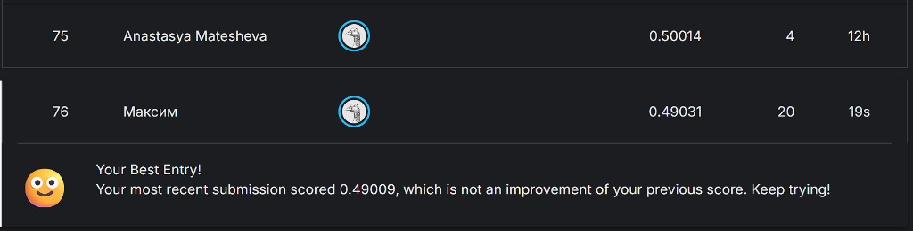

# Кластеризация сигналов сцинтилляционного детектора

Сессионное задание, [Kaggle: Signal types classification](https://www.kaggle.com/competitions/signal-types-classification).

**Решение:** `solution.ipynb`  
**Лучший результат на Kaggle:** accuracy **0.49031**

## Лидерборд Kaggle

